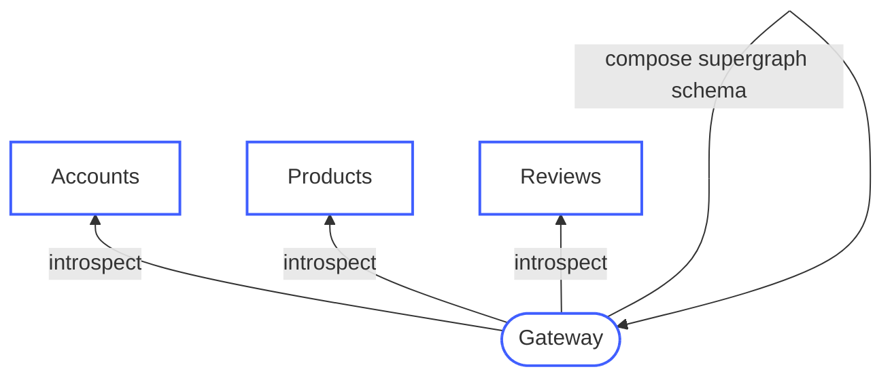
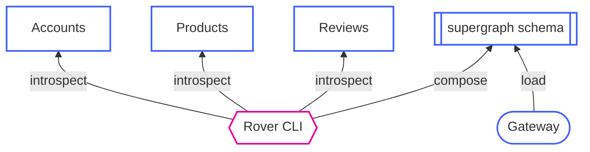
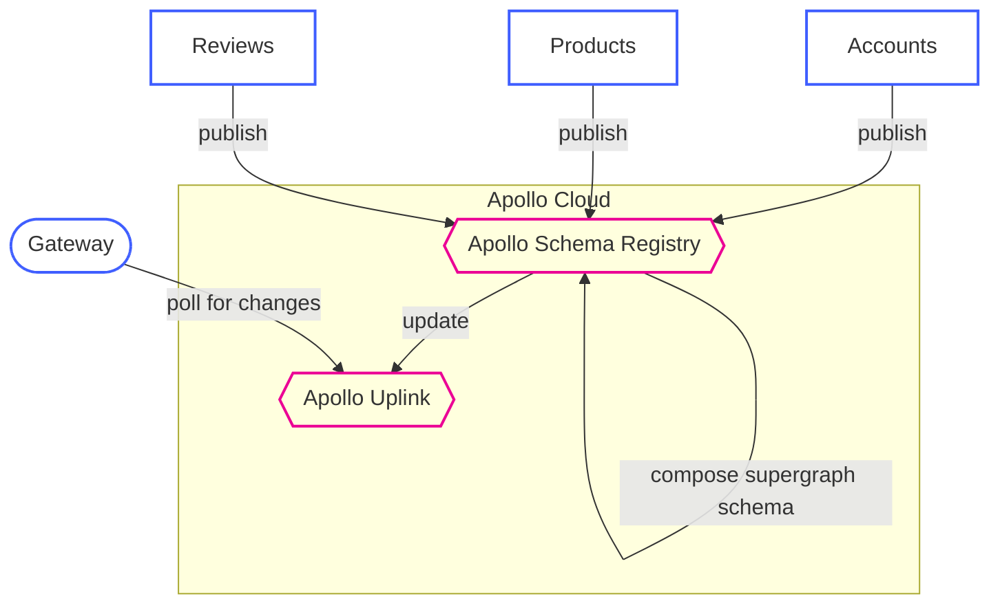

# Apollo Managed Federation Example

An example of using GraphQL managed Federation with Apollo Studio.

## Prerequisites

[Git](https://git-scm.com/book/en/v2/Getting-Started-Installing-Git) | [Bash](https://www.google.de/search?q=install+bash) | [Node](https://nodejs.org/en/download) | [Yarn](https://classic.yarnpkg.com/en/docs/install)

## Usage

```bash
git clone https://github.com/n4bb12/apollo-managed-federation-example
cd apollo-managed-federation-example
yarn dev
open http://localhost:3000
```

## Types

To re-generate TypeScript types for this project, run

```
yarn types
```

## Workflows Compared

### Introspect and Compose



```ts title="server.ts"
const supergraphSdl = new IntrospectAndCompose({
  subgraphs: [
    { name: "accounts", url: "http://localhost:3001" },
    { name: "products", url: "http://localhost:3002" },
    { name: "reviews", url: " http://localhost:3003" },
  ],
})

const gateway = new ApolloGateway({ supergraphSdl })
const server = new ApolloServer({ gateway })

server.listen(3000)
```

### Compose Offline



**Compose Supergraph Locally**

```yml title="supergraph.yaml"
subgraphs:
  accounts:
    routing_url: http://localhost:3001
    schema:
      file: src/accounts/schema.gql
  products:
    routing_url: http://localhost:3002
    schema:
      file: src/products/schema.gql
  reviews:
    routing_url: http://localhost:3003
    schema:
      file: src/reviews/schema.gql
```

```sh title="rover supergraph compose"
yarn -s rover supergraph compose \
  --config ./supergraph.yml > src/gateway/schema.gql
```

```ts title="server.ts"
const supergraphSdl = readFileSync("schema.gql", "utf8")

const gateway = new ApolloGateway({ supergraphSdl })
const server = new ApolloServer({ gateway })

server.listen(3000)
```

### Managed Federation



**Authenticate Rover**

```
yarn rover config auth
yarn rover config whoami
```

**Publish Subgraph**

```
yarn rover subgraph publish apollo-managed-federation-example@current \
  --name accounts \
  --schema src/accounts/schema.gql \
  --routing-url http://localhost:3001

yarn rover subgraph publish apollo-managed-federation-example@current \
  --name products \
  --schema src/products/schema.gql \
  --routing-url http://localhost:3002

yarn rover subgraph publish apollo-managed-federation-example@current \
  --name reviews \
  --schema src/reviews/schema.gql \
  --routing-url http://localhost:3003
```
